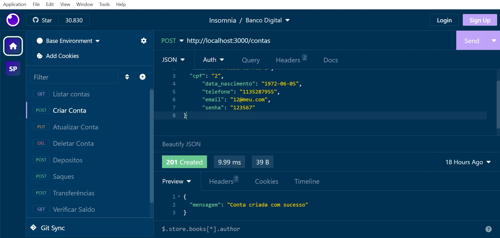
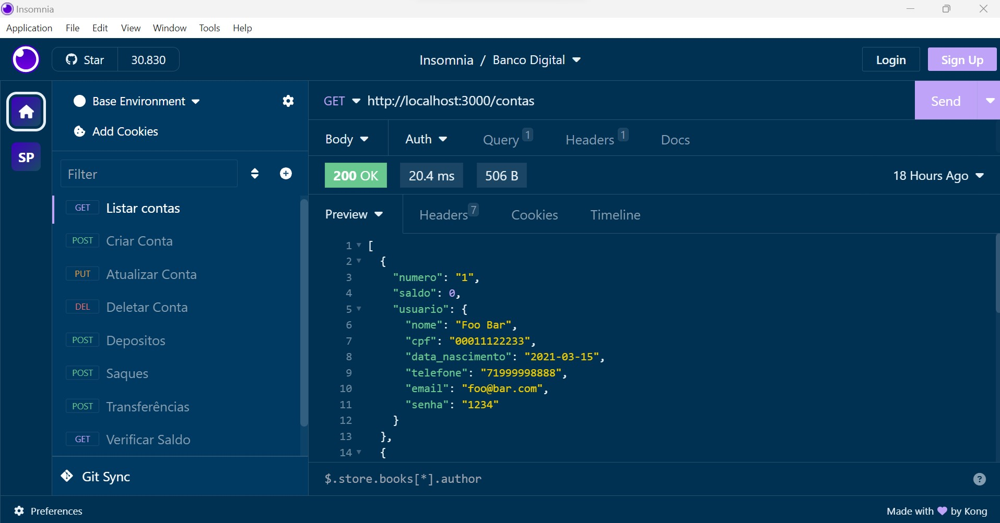
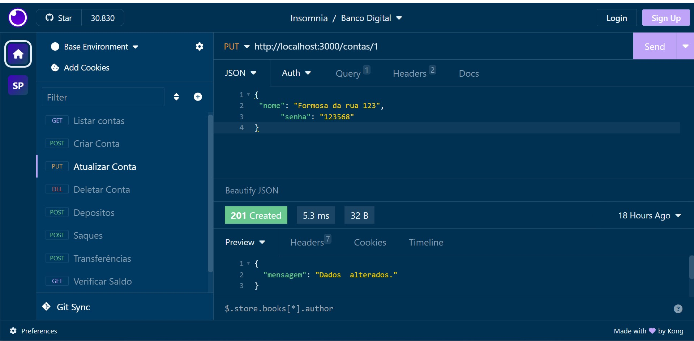
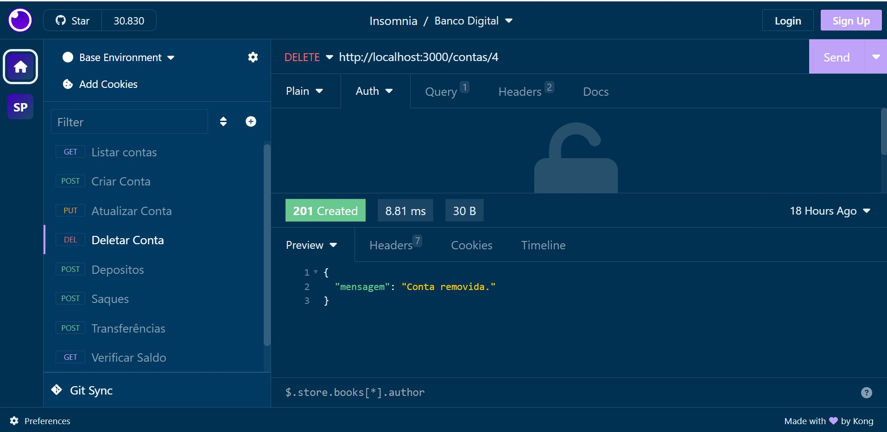
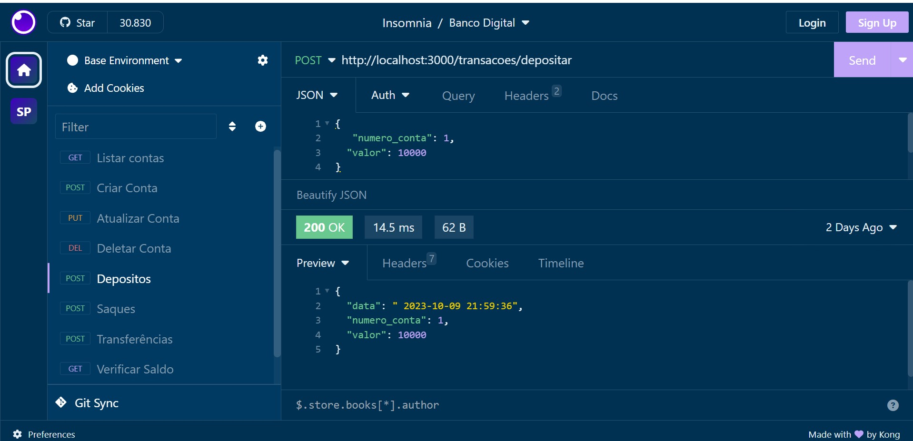
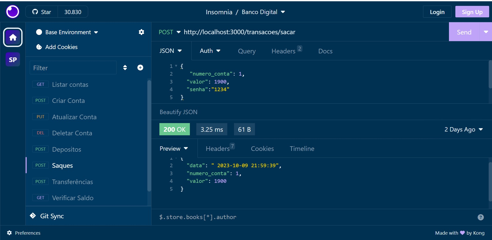
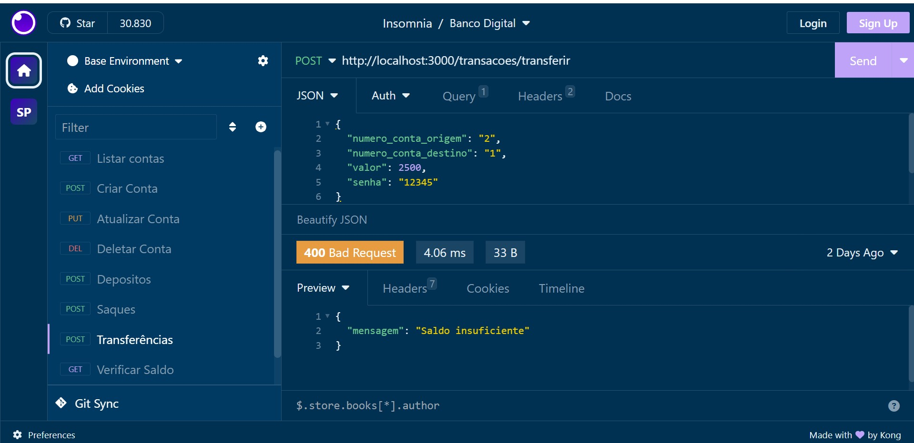
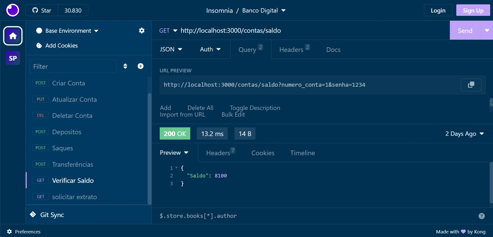
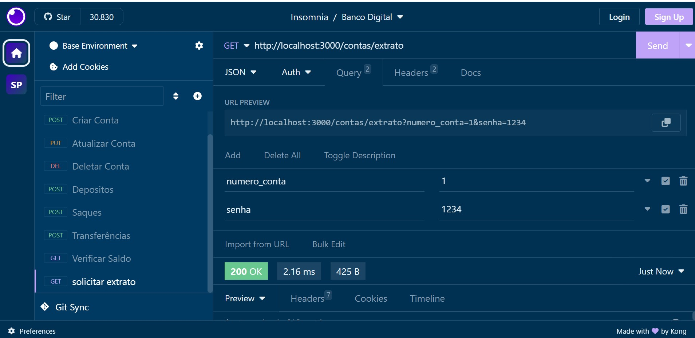

#Projeto Banco Digital

##O que é o Projeto:
Criação de uma API para um banco digital

##Como executar o Projeto:

Para executar o projeto é necessário a instalação dos seguintes bibliotecas:
express;
Date-fns;
digitar o comando npm install para instalar as dependências necessárias;
No terminal inserir o comando npm rum dev;
no prompt do navegador usar o endereço listado nas telas demonstrativas

##O que faz o Projeto:
O Projeto possui as seguintes funcionalidades:

- Criar conta bancária

- Listar contas bancárias

- Atualizar os dados do usuário da conta bancária

- Excluir uma conta bancária

- Depósitar em uma conta bancária

- Sacar de uma conta bancária

- Transferir valores entre contas bancárias

- Consultar saldo da conta bancária

- Emitir extrato bancário

T
